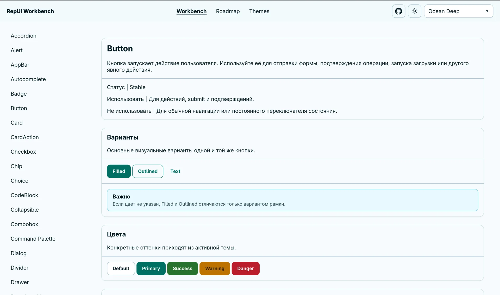
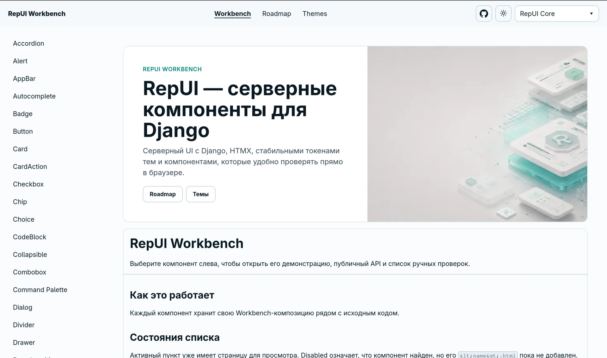
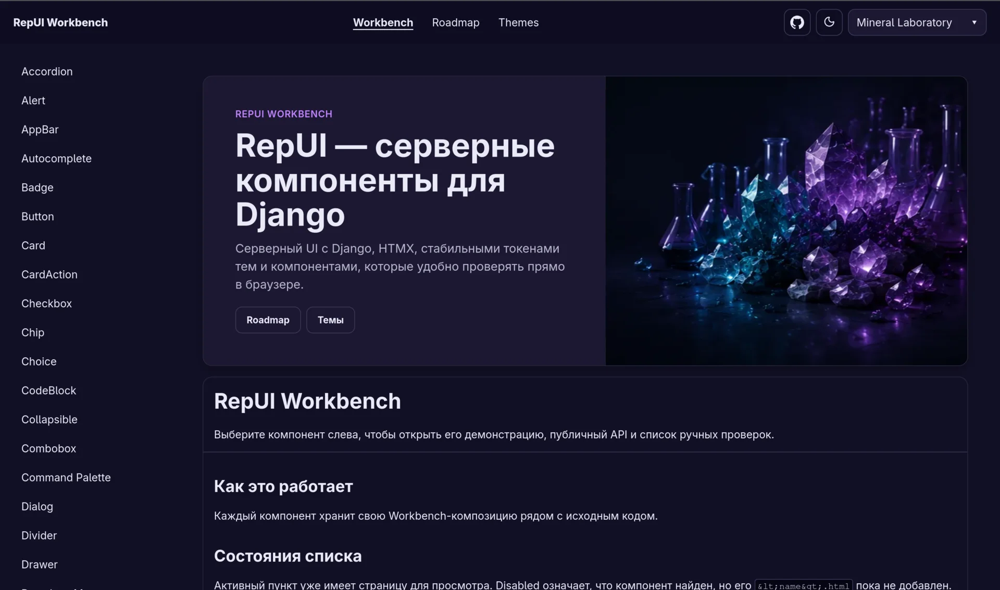

<p align="center">
  
</p>

<h1 align="center">RepUI</h1>

<p align="center">
  <strong>Server-first UI components for Django.</strong>
</p>

<p align="center">
  Build modern interfaces with Django template tags, native HTML,
  minimal JavaScript and first-class HTMX support.
</p>

<p align="center">
  <a href="https://github.com/vap-tech/RepUI/actions">
    
  </a>
  <a href="LICENSE">
    
  </a>
</p>

> **Pre-release**
>
> RepUI is under active development. The component API, runtime lifecycle
> and packaging contract are being stabilized before the first public release.
> The project is not yet published on PyPI.

## What is RepUI?

RepUI is a component library designed specifically for server-rendered
Django applications.

Components are rendered directly from Django templates:

```django



  Save changes

````

RepUI does not require React, Vue or another client-side framework.
JavaScript is used only where native HTML and CSS are not enough.

The library focuses on:

* Django template tags and reusable templates;
* native HTML semantics;
* accessible keyboard interaction;
* HTMX-compatible component lifecycles;
* minimal and isolated JavaScript runtimes;
* token-based light and dark themes;
* composable components instead of large abstractions.

## Why RepUI exists

RepUI started while I was building
[rep36.ru](https://rep36.ru/) with Django.

Django provides an excellent backend and a powerful administration
interface, but I could not find a component library that felt natural
inside server-rendered templates and provided a pleasant interface out
of the box.

I wanted to write something as simple as:

```django

  Continue

```

and get a consistent, usable component without first introducing a
client-side application, a JavaScript build system or a separate
frontend repository.

The first components were created for that project. Later, RepUI
gradually became a reusable library.

## Used in real projects

After the initial experiments, I started using RepUI at work to build
interfaces for internal users.

It is particularly useful for applications that need more flexibility
than the default Django Admin, while keeping the speed and simplicity
of server-side development.

RepUI is now used for:

* quickly prototyping internal interfaces;
* building focused business applications instead of extending every
  workflow through Django Admin;
* adding modern UI elements to Django Admin where they provide real
  value;
* creating HTMX-powered interfaces without maintaining a separate SPA.

The component set is still intentionally limited, but so far it has
covered a surprising amount of practical work.

RepUI does not try to replace Django Admin. Django Admin remains an
excellent administration tool. RepUI targets interfaces in which users
work regularly and need a more purpose-built experience.

## Themes

RepUI themes are not only light and dark color switches. A theme
defines a coherent visual system through semantic and component tokens.

### RepUI Core

The official appearance of the library: calm surfaces, restrained
contrast and an emphasis on readability.

<p align="center">
  
</p>

### Mineral Laboratory

A more expressive theme inspired by minerals, laboratory glass and
soft illuminated surfaces. It demonstrates how far the same component
contracts can be transformed without changing their structure.

<p align="center">
  
</p>

Additional themes and interactive component examples are available in
the Workbench.

## Design principles

### Server first

Components are rendered by Django. Client-side code enhances the
result instead of owning the application.

### Native HTML first

RepUI prefers native elements such as `button`, `input`, `select`,
`fieldset` and `dialog` whenever they already provide the required
semantics and behavior.

### Composition over inheritance

Complex components are assembled from smaller mechanisms.

For example:

```text
Select
├── native select
├── trigger
├── listbox
├── overlay portal
└── dismiss layer
```

A Select does not inherit from Menu even when both display a similar
floating list. A Select chooses a value; a Menu activates a command.

### Themes change tokens, not layout

Themes override semantic and component tokens. They should not replace
component markup or alter its structural layout.

### Accessibility is part of the contract

Keyboard interaction, focus management, native semantics and accessible
state are treated as component requirements rather than optional
enhancements.

### JavaScript must have a lifecycle

Interactive runtimes must support mounting, refreshing and destruction,
including after HTMX swaps.

## Current component areas

RepUI currently includes components and primitives for:

* actions and content;
* typography and icons;
* forms and choices;
* cards, panels and layout;
* lists and navigation;
* menus, listboxes and overlays;
* dialogs, drawers and tooltips;
* feedback and status display;
* theme-aware documentation and Workbench compositions.

The exact catalog is still evolving. RepUI prioritizes stable contracts
over matching the size of larger frontend component libraries.

## Project status

The current focus is architectural stabilization before the first
public package release:

* consolidating the runtime registry and HTMX lifecycle;
* finalizing the component manifest contract;
* removing transitional and legacy entry points;
* standardizing template-tag argument validation;
* expanding browser interaction tests;
* preparing Python packaging and release automation;
* documenting public component APIs.

See the project roadmap and open issues for current work.

## Installation

RepUI is not yet published on PyPI.

For now, the repository is intended for source review, development and
integration testing:

```bash
git clone https://github.com/vap-tech/RepUI.git
cd RepUI
```

Stable installation instructions will be added after the package
metadata, static assets and public API have been verified from built
wheel and source distributions.

Until then, avoid presenting the repository as a drop-in dependency for
unrelated production projects.

## Development

A typical development workflow will look like:

```bash
python -m venv .venv
source .venv/bin/activate
```

```bash
# Install project dependencies using the repository's
# current development instructions.
```

```bash
python manage.py test
```

```bash
python manage.py runserver
```

Open the Workbench to review components, compositions, themes and
interactive behavior.

> The exact setup commands should be updated when `pyproject.toml` and
> the supported Python/Django matrix are finalized.

## Testing

RepUI uses several levels of verification:

* Django render and template-tag tests;
* component manifest and asset checks;
* JavaScript interaction unit tests;
* Workbench composition rendering;
* theme-contract checks;
* browser interaction tests for keyboard, focus and overlays.

The CI badge represents the main test workflow.

A coverage badge will be added when coverage collection is stable and
the reported percentage covers meaningful Python and JavaScript paths,
rather than only template-render tests.

## Roadmap

The broad development direction is:

* stabilize existing component contracts;
* complete the form component family;
* consolidate runtime mounting and cleanup;
* strengthen loading and feedback states;
* improve browser-level accessibility tests;
* prepare the first installable package;
* publish documentation and a hosted Workbench;
* add specialized components only when real projects require them.

RepUI intentionally does not aim to reproduce every component from a
large SPA-oriented UI framework.

The goal is a smaller, coherent toolkit that covers most
server-rendered business applications well.

## Contributing

Contributions are welcome, especially when they solve a demonstrated
use case.

Before adding a new primitive or runtime abstraction, check whether the
problem can be solved through:

* native HTML;
* an existing interaction primitive;
* composition of existing components;
* a component token extension.

Core contribution principles:

```text
Prefer native HTML.
Keep JavaScript isolated.
Compose components.
Do not couple components to a concrete theme.
Themes change tokens, not layout.
Accessibility is not optional.
Every runtime cleans up after itself.
```

See [CONTRIBUTING.md](CONTRIBUTING.md) for architecture, testing and
component requirements.

## License

RepUI is available under the [MIT License](LICENSE).
